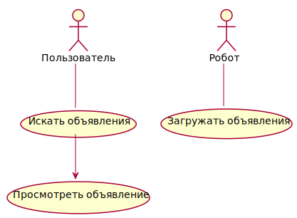
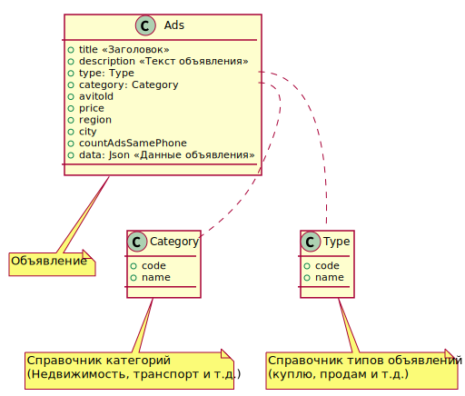
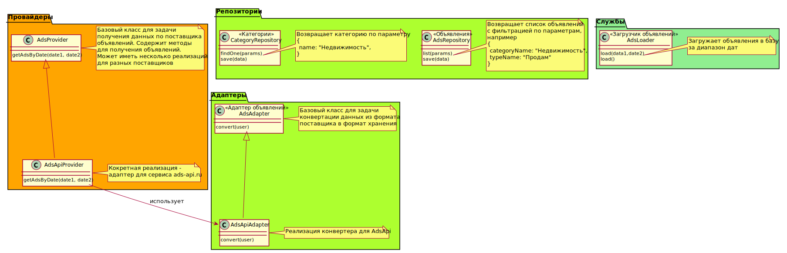

# Профиль пользователя

## Требования к системе
Сервис "Просмотр объявлений" предназначен для загрузки, хранения и просмотра объявлений

1. Пользователь может искать объявления по параметрам  
2. Пользователь может просматривать детали выбранного объяявления
3. Система может загружать объявления из внешних источников (asd-api.ru)

## Варианты использования системы

## Модель данных

## Модель предметной области

